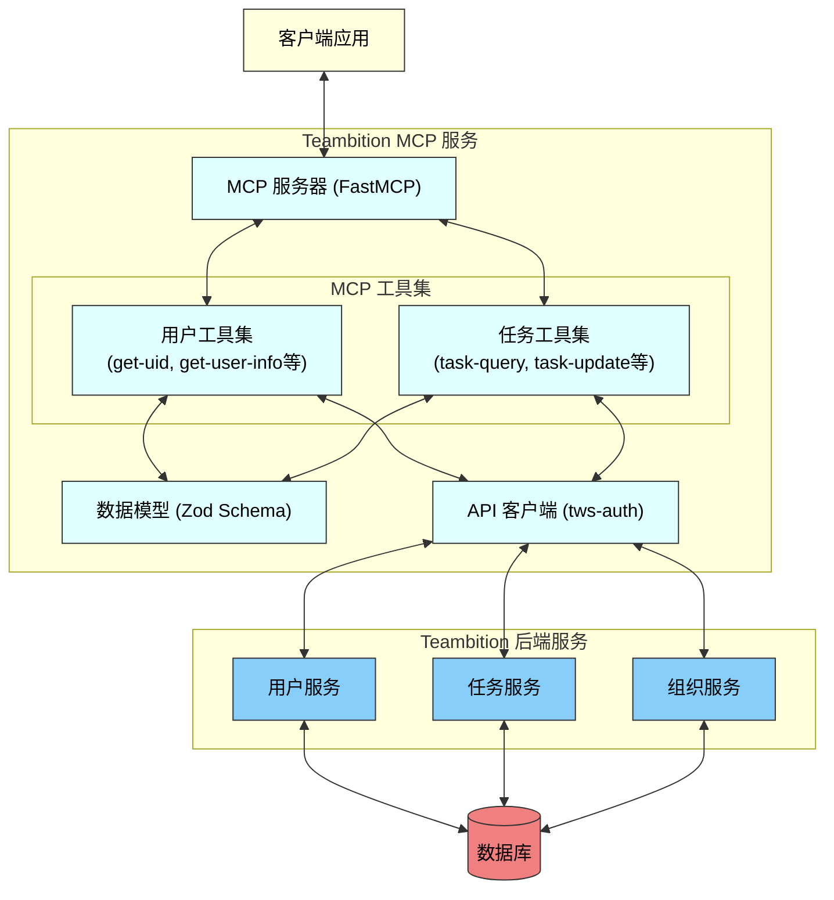
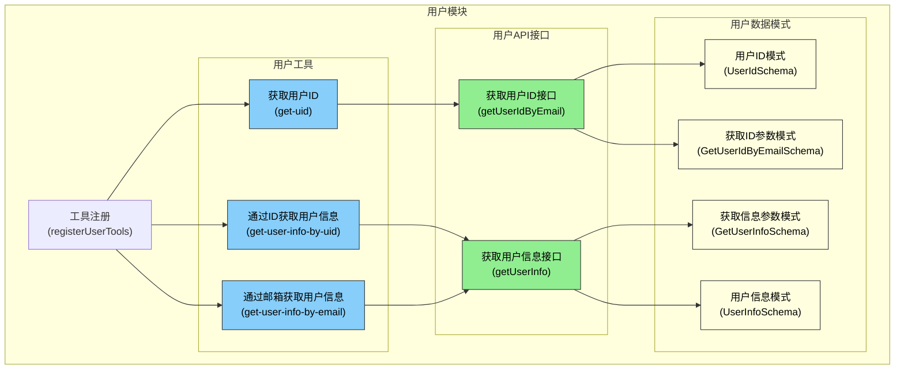
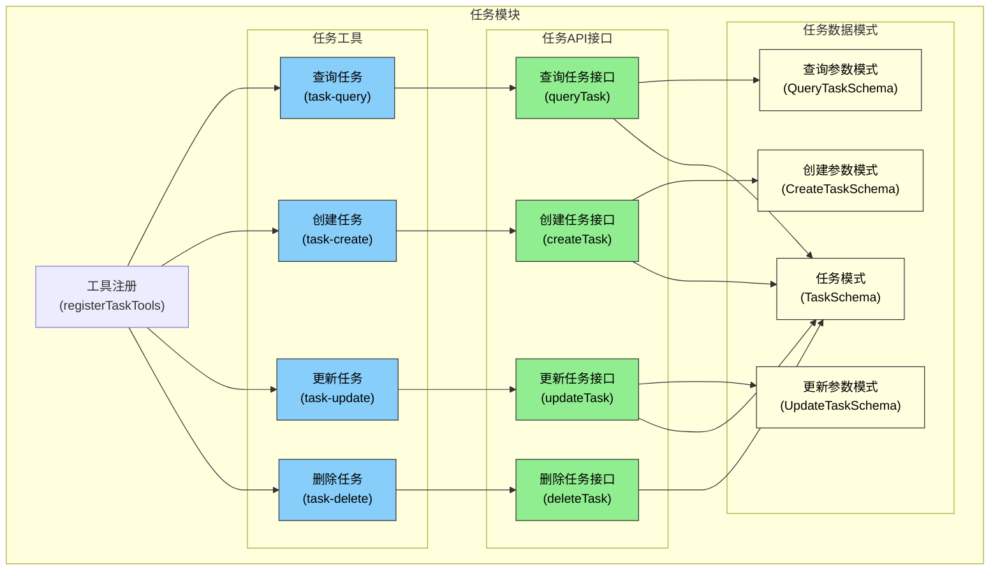
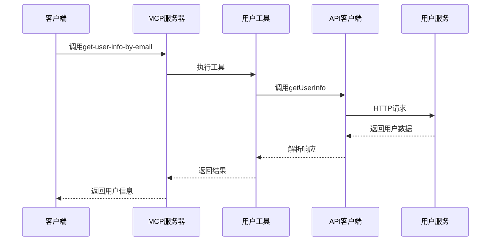
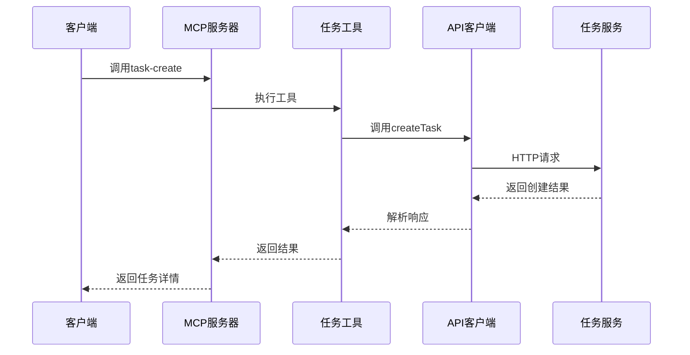
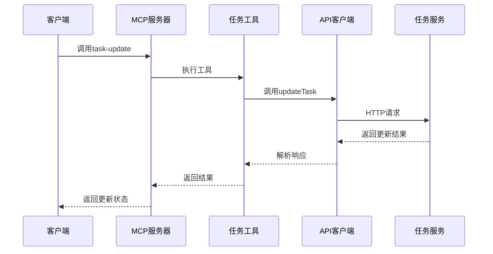

*Teambition MCP - 用户和任务模块技术方案*

- [1. 版本与职责](#1-版本与职责)
  - [1.1. 修订历史](#11-修订历史)
  - [1.2. 责任人职责](#12-责任人职责)
  - [1.3. 具体责任人分配](#13-具体责任人分配)
- [2. 项目概述与技术目标](#2-项目概述与技术目标)
  - [2.1. 业务背景](#21-业务背景)
  - [2.2. 核心需求与设计参考](#22-核心需求与设计参考)
  - [2.3. 方案目标](#23-方案目标)
  - [2.4. 技术范围](#24-技术范围)
  - [2.5. 上下游依赖](#25-上下游依赖)
    - [2.5.1. 上游依赖 (本方案强依赖的系统/模块/数据)](#251-上游依赖-本方案强依赖的系统模块数据)
    - [2.5.2. 下游依赖 (依赖本方案产出的系统/模块)](#252-下游依赖-依赖本方案产出的系统模块)
  - [2.6. 技术栈选型](#26-技术栈选型)
- [3. 系统整体架构设计](#3-系统整体架构设计)
  - [3.1. 整体逻辑架构图](#31-整体逻辑架构图)
  - [3.2. 模块详细架构图](#32-模块详细架构图)
    - [用户模块架构](#用户模块架构)
    - [任务模块架构](#任务模块架构)
  - [3.3. 关键业务流程时序图](#33-关键业务流程时序图)
    - [用户信息查询流程](#用户信息查询流程)
    - [任务创建流程](#任务创建流程)
    - [任务更新流程](#任务更新流程)
- [4. 服务端核心模块详细设计](#4-服务端核心模块详细设计)
  - [4.1. 用户模块](#41-用户模块)
    - [4.1.1. 模块职责与目标](#411-模块职责与目标)
    - [4.1.2. 重点逻辑与算法](#412-重点逻辑与算法)
      - [用户信息查询流程](#用户信息查询流程-1)
      - [参数验证逻辑](#参数验证逻辑)
      - [接口选择逻辑](#接口选择逻辑)
    - [4.1.3. 内部组件](#413-内部组件)
    - [4.1.4. 关键考量点](#414-关键考量点)
  - [4.2. 任务模块](#42-任务模块)
    - [4.2.1. 模块职责与目标](#421-模块职责与目标)
    - [4.2.2. 重点逻辑与算法](#422-重点逻辑与算法)
      - [任务创建流程](#任务创建流程-1)
      - [任务更新流程](#任务更新流程-1)
      - [任务查询优化](#任务查询优化)
    - [4.2.3. 内部组件](#423-内部组件)
    - [4.2.4. 关键考量点](#424-关键考量点)
- [5. 接口设计 (API Specification)](#5-接口设计-api-specification)
  - [5.1. 结构规范](#51-结构规范)
  - [5.2. 用户接口列表](#52-用户接口列表)
    - [5.2.1 根据邮箱获取用户 ID](#521-根据邮箱获取用户-id)
    - [5.2.2 根据用户 ID 获取用户信息](#522-根据用户-id-获取用户信息)
    - [5.2.3 根据邮箱获取用户信息](#523-根据邮箱获取用户信息)
  - [5.3. 任务接口列表](#53-任务接口列表)
    - [5.3.1 查询任务](#531-查询任务)
    - [5.3.2 创建任务](#532-创建任务)
    - [5.3.3 更新任务](#533-更新任务)
    - [5.3.4 删除任务](#534-删除任务)
    - [5.3.5 任务评论](#535-任务评论)
- [6. 数据库设计](#6-数据库设计)
  - [6.1. 数据库表结构](#61-数据库表结构)
- [7. 测试策略](#7-测试策略)
  - [7.1 单元测试](#71-单元测试)
  - [7.2 集成测试](#72-集成测试)
  - [7.3 端到端测试](#73-端到端测试)
  - [7.4 性能测试](#74-性能测试)
- [8. 附录](#8-附录)
  - [8.1 术语表](#81-术语表)
  - [8.2 参考文档](#82-参考文档)

# 1. 版本与职责

## 1.1. 修订历史

| 版本 | 修订日期     | 修订描述     | 修改人 |
| :--- | :----------- | :----------- | :----- |
| v1.0 | 2023-12-12   | 初版创建     | 团队   |

## 1.2. 责任人职责

| 人员角色     | 主要职责                                                                                                                                                              |
| :----------- | :-------------------------------------------------------------------------------------------------------------------------------------------------------------------- |
| **总负责人**   | 1. 负责技术方案的整体完整性和一致性<br>2. 作为技术方案变更的第一同步责任人<br>3. 负责跨模块的技术协调与沟通<br>4. 负责最终技术选型和架构决策的把关<br>5. 作为项目上线后的技术问题总接口人 |
| **服务端负责人** | 1. 负责服务端技术方案的详细设计和可实施性<br>2. 确保服务端方案与整体架构的协同一致<br>3. 负责服务端模块的开发、测试、部署及上线工作<br>4. 作为服务端线上问题的第一接口人 |
| **前端负责人** | 1. 负责前端技术方案的合理性<br>2. 确保前端与服务端的技术对接顺畅<br>3. 前端涉及的技术方案变更需及时更新相关文档 |
| **测试负责人**   | 1. 负责制定和执行测试策略和测试计划<br>2. 协调测试资源，跟踪缺陷修复，对上线质量负责 |
| **协作人**     | 协助对应模块的负责人，参与技术方案的讨论、设计、实现和测试等工作 |

## 1.3. 具体责任人分配

| 角色          | 负责人姓名 | 协作人姓名                |
| :------------ | :--------- | :------------------------ |
| **整体方案**  | [待定]     | [待定]                    |
| **服务端**    | [待定]     | [待定]                    |
| **前端**      | [待定]     | [待定]                    |
| **测试**      | [待定]     | [待定]                    |

---

# 2. 项目概述与技术目标

## 2.1. 业务背景

Teambition MCP (Model Context Protocol) 服务是为 Teambition 平台提供用户信息和任务管理功能的基础服务层。随着 Teambition 平台的业务扩展和用户增长，需要一个统一、高效的方式来处理用户信息查询和任务管理操作，以支持多种客户端应用（Web、移动端、第三方集成等）的需求。

本技术方案主要针对 Teambition MCP 中的用户模块和任务模块进行设计，这两个模块作为平台的核心功能，承担着用户身份识别、信息查询以及任务创建、更新、查询等重要功能，是整个平台协作流程的基础。

## 2.2. 核心需求与设计参考

**核心需求点**:

* 用户模块:
  * 根据邮箱获取用户 ID
  * 根据用户 ID 获取用户详细信息
  * 根据邮箱获取用户信息
  * 批量查询用户信息
  * 支持用户偏好设置查询

* 任务模块:
  * 任务的创建、查询、更新和删除
  * 支持任务详情、标题、备注、截止时间等属性的管理
  * 任务执行者、参与者的分配与管理
  * 任务状态更新与流转
  * 任务标签、优先级等元数据管理
  * 支持任务评论功能

**设计参考**:
* Teambition API 文档
* MCP 协议规范
* 现有用户和任务相关接口的实现

## 2.3. 方案目标

1. 设计并实现基于 MCP 协议的用户信息服务，提供高效、稳定的用户数据查询能力
2. 设计并实现基于 MCP 协议的任务管理服务，支持任务全生命周期的操作
3. 确保服务具有良好的可扩展性，能够随业务需求变化而灵活调整
4. 提供标准化的接口和文档，便于客户端和第三方系统集成
5. 保证数据安全和用户隐私，符合相关法规要求

## 2.4. 技术范围

**包含范围 (In Scope):**
* 用户模块的 MCP 工具设计与实现
* 任务模块的 MCP 工具设计与实现
* 与 Teambition 后端服务的集成对接
* 数据模型定义和接口规范
* 单元测试和集成测试
* 性能优化和错误处理

**排除范围 (Out of Scope):**
* 前端 UI 实现（由客户端团队负责）
* 用户认证和授权系统（使用现有系统）
* 具体业务逻辑的实现（依赖 Teambition 后端服务）
* 复杂的报表和分析功能
* 第三方系统的深度集成

## 2.5. 上下游依赖

### 2.5.1. 上游依赖 (本方案强依赖的系统/模块/数据)

* **Teambition 用户服务**:
  * 依赖接口/数据: 用户信息查询、用户身份验证
  * 负责人: [待定]

* **Teambition 任务服务**:
  * 依赖接口/数据: 任务增删改查相关接口
  * 负责人: [待定]

* **企业组织服务**:
  * 依赖接口/数据: 组织信息、组织成员关系
  * 负责人: [待定]

### 2.5.2. 下游依赖 (依赖本方案产出的系统/模块)

* **知音楼**:
  * 依赖接口/数据: 用户信息、任务管理接口
  * 负责人: [待定]

* **Dify 工具**:
  * 依赖接口/数据: 用户信息、任务管理接口
  * 负责人: [待定]

* **支持 MCP 的客户端**:
  * 依赖接口/数据: 用户信息、任务管理接口
  * 负责人: [待定]

## 2.6. 技术栈选型
| 技术领域         | 选用技术/工具                    | 选型理由                                                          | 备选方案              |
| :--------------- | :------------------------------- | :---------------------------------------------------------------- | :-------------------- |
| **编程语言**     | TypeScript                       | 静态类型安全、生态丰富、团队熟悉度高                              | JavaScript, Go        |
| **Web框架**      | Node.js + FastMCP                | 高性能、异步处理能力强、符合 MCP 协议规范                         | Express, Koa          |
| **数据验证**     | Zod                              | TypeScript 友好、运行时类型验证、模式定义清晰                     | Joi, Yup              |
| **API调用**      | tws-auth                         | 内部认证服务、统一认证管理、安全性高                              | Axios, fetch          |
| **测试框架**     | Vitest                           | 快速、类型安全、与 TypeScript 集成良好                            | Jest, Mocha + Chai    |
| **代码规范**     | ESLint                           | 强制代码风格一致性、提高代码质量                                  | TSLint                |
| **环境配置**     | dotenv                           | 简单易用、环境变量管理、安全性好                                  | node-config           |

# 3. 系统整体架构设计

## 3.1. 整体逻辑架构图



上图展示了 Teambition MCP 服务的整体逻辑架构，主要由以下几部分组成：

1. **客户端应用**：使用 MCP 协议与服务器交互的各类客户端，包括 Web 端、移动端等。

2. **MCP 服务器**：基于 FastMCP 实现的 MCP 协议服务器，负责接收客户端请求并调用相应的工具处理。

3. **MCP 工具集**：
   - **用户工具集**：包含获取用户 ID、获取用户信息等工具。
   - **任务工具集**：包含任务查询、创建、更新等工具。

4. **数据模型**：使用 Zod 定义的数据验证模式，确保数据的类型安全和格式正确。

5. **API 客户端**：基于 tws-auth 的 HTTP 客户端，负责与 Teambition 后端服务通信。

6. **Teambition 后端服务**：提供用户、任务、组织等核心业务逻辑的后端服务。

7. **数据库**：存储用户、任务、组织等数据的数据库系统。

## 3.2. 模块详细架构图

### 用户模块架构



### 任务模块架构



## 3.3. 关键业务流程时序图

### 用户信息查询流程



### 任务创建流程



### 任务更新流程



# 4. 服务端核心模块详细设计

## 4.1. 用户模块

### 4.1.1. 模块职责与目标

用户模块主要负责提供用户相关的信息查询服务，是整个系统的基础模块。其核心职责包括：

1. 提供根据邮箱获取用户 ID 的能力
2. 提供根据用户 ID 获取用户信息的能力
3. 提供根据邮箱获取用户信息的能力
4. 确保用户数据的安全访问和类型安全

设计目标：
- 类型安全：严格定义和验证数据模型
- 易扩展：支持快速添加新的用户相关功能

### 4.1.2. 重点逻辑与算法

#### 用户信息查询流程

1. **参数验证**：使用 Zod 进行请求参数的严格验证，确保必要字段存在且格式正确
2. **请求转发**：根据不同的查询类型（通过 ID 或邮箱）选择相应的 API 端点
3. **错误处理**：统一处理网络错误、超时、数据格式错误等异常情况
4. **响应转换**：将 Teambition 后端响应转换为符合 MCP 协议的统一格式

#### 参数验证逻辑

```ts
// 参数验证示例
const GetUserIdByEmailSchema = z.object({
  email: z.string().email('邮箱格式不正确'),
  orgId: z.string().optional().describe('组织ID'),
})

// 使用验证模式
const validatedData = GetUserIdByEmailSchema.parse(inputData)
```

#### 接口选择逻辑

```ts
// 根据参数类型选择不同的API接口
if ('userId' in validData) {
  // 通过用户ID查询
  query.userId = validData.userId
  path = 'user/info'
}
else {
  // 通过邮箱查询
  query.email = validData.email
  path = 'user/query'
}
```

### 4.1.3. 内部组件

用户模块主要包含以下关键组件：

1. **用户工具注册组件**：负责将用户相关工具注册到 MCP 服务器
   ```ts
   // 注册示例
   export function registerUserTools(tbMCPServer: TbMCPServer) {
     registerGetUidTool(tbMCPServer)
     registerGetUserInfoByUidTool(tbMCPServer)
     registerGetUserInfoByEmailTool(tbMCPServer)
   }
   ```

2. **获取用户ID工具**：根据邮箱获取用户ID
   ```ts
   // 工具实现示例
   export function registerGetUidTool(tbMCPServer: TbMCPServer) {
     tbMCPServer.server.addTool({
       name: 'get-uid',
       description: '根据邮箱获取用户 uid',
       parameters: GetUserIdByEmailSchema,
       timeoutMs: 10000,
       execute: async (args) => {
         return promise2ExecContent(
           getUserIdByEmail(args),
         )
       },
     })
   }
   ```

3. **获取用户信息工具**：根据用户ID或邮箱获取用户详细信息
   ```ts
   // 工具实现示例
   export function registerGetUserInfoByUidTool(tbMCPServer: TbMCPServer) {
     tbMCPServer.server.addTool({
       name: 'get-user-info-by-uid',
       description: '根据用户ID获取用户信息',
       parameters: GetUserInfoByUidSchema,
       timeoutMs: 10000,
       execute: async (args) => {
         return promise2ExecContent(
           getUserInfo(args),
         )
       },
     })
   }
   ```

4. **API请求组件**：封装对Teambition后端服务的请求
   ```ts
   // API请求示例
   export function getUserIdByEmail(data: GetUserIdByEmail) {
     return tbServer
       .withTenant(data.orgId ?? getOrgId(), 'organization')
       .withQuery({ email: data.email })
       .get<UserIdResponse>(`user/getid`)
   }
   ```

### 4.1.4. 关键考量点

1. **性能考量**：
   - 控制API请求超时时间，防止长时间等待
   - 考虑实现结果缓存机制，减少重复请求
   - 优化请求参数，减少传输数据量

2. **安全考量**：
   - 确保用户数据访问的权限控制
   - 敏感数据处理（如隐藏部分用户信息）
   - 防止频繁请求导致的滥用

3. **扩展性考量**：
   - 设计灵活的工具注册机制，便于添加新功能
   - 使用统一的参数验证和错误处理流程
   - 确保API模型与Teambition后端保持一致

## 4.2. 任务模块

### 4.2.1. 模块职责与目标

任务模块主要负责提供任务的创建、查询、更新和删除等核心功能，是整个协作平台的核心功能模块。其主要职责包括：

1. 提供任务的完整生命周期管理（创建、查询、更新、删除）
2. 支持任务属性的细粒度更新（标题、描述、状态、截止时间等）
3. 支持任务评论和附件管理
4. 确保任务数据的一致性和可靠性

设计目标：
- 功能完备：覆盖任务管理的全部场景
- 高性能：任务操作响应时间控制在 300ms 以内
- 高可用：服务可用性达到 99.9%
- 易用性：提供简洁明了的接口，降低使用门槛

### 4.2.2. 重点逻辑与算法

#### 任务创建流程

1. **参数验证**：使用 Zod 进行任务创建参数的严格验证
2. **默认值填充**：为可选字段设置合理的默认值
3. **请求发送**：向 Teambition 后端发送任务创建请求
4. **结果处理**：解析响应并返回创建的任务详情

#### 任务更新流程

1. **参数验证**：验证任务ID和更新字段的有效性
2. **差异计算**：仅发送有变更的字段，减少数据传输
3. **请求发送**：向 Teambition 后端发送更新请求
4. **结果处理**：返回更新结果和最新任务状态

#### 任务查询优化

```ts
// 查询参数优化示例
function optimizeQueryParams(params) {
  // 移除空值
  Object.keys(params).forEach((key) => {
    if (params[key] === undefined || params[key] === null) {
      delete params[key]
    }
  })

  // 处理特殊查询条件
  if (params.quickFilter) {
    // 转换为API支持的格式
    params.filter = convertQuickFilter(params.quickFilter)
    delete params.quickFilter
  }

  return params
}
```

### 4.2.3. 内部组件

任务模块主要包含以下关键组件：

1. **任务工具注册组件**：负责将任务相关工具注册到 MCP 服务器
   ```ts
   // 注册示例
   export function registerTaskTools(tbMCPServer: TbMCPServer) {
     registerQueryTaskTool(tbMCPServer)
     registerCreateTaskTool(tbMCPServer)
     registerUpdateTaskTool(tbMCPServer)
     registerDeleteTaskTool(tbMCPServer)
   }
   ```

2. **任务查询工具**：支持多种条件查询任务
   ```ts
   // 工具实现示例
   export function registerQueryTaskTool(tbMCPServer: TbMCPServer) {
     tbMCPServer.server.addTool({
       name: 'task-query',
       description: '查询任务详情',
       parameters: QueryTaskSchema,
       timeoutMs: 10000,
       execute: async (args) => {
         return promise2ExecContent(
           queryTask(args),
         )
       },
     })
   }
   ```

3. **任务创建工具**：创建新任务
   ```ts
   // 工具实现示例
   export function registerCreateTaskTool(tbMCPServer: TbMCPServer) {
     tbMCPServer.server.addTool({
       name: 'task-create',
       description: '创建任务',
       parameters: CreateTaskSchema,
       timeoutMs: 10000,
       execute: async (args) => {
         return promise2ExecContent(
           createTask(args),
         )
       },
     })
   }
   ```

4. **任务更新工具**：更新任务属性
   ```ts
   // 工具实现示例
   export function registerUpdateTaskTool(tbMCPServer: TbMCPServer) {
     tbMCPServer.server.addTool({
       name: 'task-update',
       description: '更新任务',
       parameters: UpdateTaskSchema,
       timeoutMs: 10000,
       execute: async (args) => {
         return promise2ExecContent(
           updateTask(args),
         )
       },
     })
   }
   ```

5. **任务删除工具**：删除任务
   ```ts
   // 工具实现示例
   export function registerDeleteTaskTool(tbMCPServer: TbMCPServer) {
     tbMCPServer.server.addTool({
       name: 'task-delete',
       description: '删除任务',
       parameters: DeleteTaskSchema,
       timeoutMs: 10000,
       execute: async (args) => {
         return promise2ExecContent(
           deleteTask(args),
         )
       },
     })
   }
   ```

### 4.2.4. 关键考量点

1. **性能考量**：
   - 优化批量操作，减少API调用次数
   - 对频繁查询的任务列表考虑缓存机制
   - 大量任务查询时的分页优化

2. **一致性考量**：
   - 确保任务更新操作的原子性
   - 处理并发更新可能导致的冲突
   - 任务状态变更的有效性验证

3. **扩展性考量**：
   - 支持任务自定义字段的扩展
   - 兼容不同项目类型的任务管理需求
   - 设计灵活的查询条件组合机制

# 5. 接口设计 (API Specification)

## 5.1. 结构规范

Teambition MCP 服务遵循以下接口规范：

- **请求格式**：MCP 工具调用，参数使用 JSON 格式
- **认证方式**：通过环境变量配置的 API 密钥或 OAuth 2.0 令牌
- **错误处理**：统一的错误码和错误信息格式

**MCP 标准响应格式**（`ContentResult` 类型）：
```json
{
  "isError": false, // 成功为 false，失败为 true
  "content": [
    {
      "text": "JSON 字符串形式的响应数据",
      "type": "text"
    }
  ]
}
```

**API 标准响应结构**（`TBResponse<T>` 类型）：
```json
{
  "code": 200, // 状态码，200 表示成功
  "errorMessage": "错误信息", // 错误描述
  "requestId": "请求ID", // 请求标识
  "result": { // 业务数据
    // 具体数据字段，类型为泛型 T
  }
}
```

## 5.2. 用户接口列表

### 5.2.1 根据邮箱获取用户 ID

**工具名称**：`get-uid`
**描述**：根据邮箱获取用户 ID

**参数**：
```ts
interface Params {
  email: string // 查询用户邮箱
  orgId?: string // 可选的组织ID
}
```

**响应流程**：
1. 先调用API获取`TBResponse<T>`格式的响应
2. 通过`promise2ExecContent`函数转换为MCP的`ContentResult`格式

**MCP响应格式**（成功）：
```ts
{
  isError: false
  content: [
    {
      text: JSON.stringify({ id: '用户ID' }),
      type: 'text'
    }
  ]
}
```

**MCP响应格式**（失败）：
```ts
{
  isError: true
  content: [
    {
      text: '错误信息',
      type: 'text'
    }
  ]
}
```

### 5.2.2 根据用户 ID 获取用户信息

**工具名称**：`get-user-info-by-uid`
**描述**：根据用户 ID 获取用户详细信息

**参数**：
```ts
interface Params {
  userId: string // 用户ID
  orgId?: string // 可选的组织ID
}
```

**响应流程**：
1. 先调用API获取`TBResponse<T>`格式的响应
2. 通过`promise2ExecContent`函数转换为MCP的`ContentResult`格式

**MCP响应格式**（成功）：
```ts
{
  isError: false
  content: [
    {
      text: JSON.stringify({
        id: '用户ID',
        avatarUrl: '用户头像URL',
        name: '用户名称'
      }),
      type: 'text'
    }
  ]
}
```

### 5.2.3 根据邮箱获取用户信息

**工具名称**：`user_get_info_by_email`
**描述**：根据邮箱获取用户详细信息

**参数**：
```ts
interface Params {
  email: string // 用户邮箱
  orgId?: string // 可选的组织ID
}
```

**响应流程**：
1. 先调用API获取`TBResponse<T>`格式的响应
2. 通过`promise2ExecContent`函数转换为MCP的`ContentResult`格式

**MCP响应格式**（成功）：
```ts
{
  isError: false
  content: [
    {
      text: JSON.stringify({
        id: '用户ID',
        avatarUrl: '用户头像URL',
        name: '用户名称'
      }),
      type: 'text'
    }
  ]
}
```

## 5.3. 任务接口列表

### 5.3.1 查询任务

**工具名称**：`task-query`
**描述**：查询任务详情

**参数**：
```ts
interface Params {
  taskId?: string // 任务ID，与 shortIds 二选一
  shortIds?: string // 任务短ID集合，逗号分隔
  parentTaskId?: string // 父任务ID，查询子任务时使用
}
```

**响应流程**：
1. 先调用API获取`TBResponse<T>`格式的响应
2. 通过`promise2ExecContent`函数转换为MCP的`ContentResult`格式

**MCP响应格式**（成功）：
```ts
{
  isError: false,
  content: [
    {
      text: JSON.stringify([{
        id: '任务ID',
        content: '任务标题',
        note: '任务备注',
        projectId: '项目ID',
        executorId: '执行者ID',
        involveMembers: ['参与者ID1', '参与者ID2'],
        priority: 1,
        startDate: '开始时间',
        dueDate: '截止时间'
        // 其他任务属性...
      }]),
      type: 'text'
    }
  ]
}
```

### 5.3.2 创建任务

**工具名称**：`task-create`
**描述**：创建新任务

**参数**：
```ts
{
  projectId: string,         // 项目ID
  content: string,           // 任务标题
  executorId?: string,       // 执行者ID
  involveMembers?: string[], // 参与者ID列表
  note?: string,             // 任务备注
  priority?: number,         // 任务优先级
  startDate?: string,        // 开始时间
  dueDate?: string,          // 截止时间
  // 其他任务属性...
}
```

**响应流程**：
1. 先调用API获取`TBResponse<T>`格式的响应
2. 通过`promise2ExecContent`函数转换为MCP的`ContentResult`格式

**MCP响应格式**（成功）：
```ts
{
  isError: false,
  content: [
    {
      text: JSON.stringify({
        id: "任务ID",
        content: "任务标题",
        // 任务完整信息...
      }),
      type: "text"
    }
  ]
}
```

### 5.3.3 更新任务

**工具名称**：`task-update`
**描述**：更新任务属性

**参数**：
```ts
{
  taskId: string,            // 任务ID
  content?: string,          // 任务标题
  note?: string,             // 任务备注
  executorId?: string,       // 执行者ID
  priority?: number,         // 任务优先级
  startDate?: string,        // 开始时间
  dueDate?: string,          // 截止时间
  // 其他可更新字段...
}
```

**响应流程**：
1. 先调用API获取`TBResponse<T>`格式的响应
2. 通过`promise2ExecContent`函数转换为MCP的`ContentResult`格式

**MCP响应格式**（成功）：
```ts
{
  isError: false,
  content: [
    {
      text: JSON.stringify({
        updated: "更新时间",
        // 可能包含更新的字段...
      }),
      type: "text"
    }
  ]
}
```

### 5.3.4 删除任务

**工具名称**：`task-delete`
**描述**：删除任务

**参数**：
```ts
{
  taskId: string // 任务ID
}
```

**响应流程**：
1. 先调用API获取`TBResponse<T>`格式的响应
2. 通过`promise2ExecContent`函数转换为MCP的`ContentResult`格式

**MCP响应格式**（成功）：
```ts
{
  isError: false,
  content: [
    {
      text: JSON.stringify({}),  // 空对象表示删除成功
      type: "text"
    }
  ]
}
```

### 5.3.5 任务评论

**工具名称**：`task-comment`
**描述**：为任务添加评论

**参数**：
```ts
{
  taskId: string,            // 任务ID
  content: string,           // 评论内容
  mentionUserIds?: string[]  // @提及的用户ID列表
}
```

**响应流程**：
1. 先调用API获取`TBResponse<T>`格式的响应
2. 通过`promise2ExecContent`函数转换为MCP的`ContentResult`格式

**MCP响应格式**（成功）：
```ts
{
  isError: false,
  content: [
    {
      text: JSON.stringify({
        id: "评论ID",
        content: {
          title: "标题",
          comment: "评论内容"
        },
        creatorId: "创建者ID",
        createTime: "创建时间"
      }),
      type: "text"
    }
  ]
}
```

# 6. 数据库设计

## 6.1. 数据库表结构

由于 Teambition MCP 服务主要作为中间层，实际的数据存储由 Teambition 后端服务负责，所以本方案不涉及直接的数据库表设计。

# 7. 测试策略

## 7.1 单元测试

单元测试主要针对各个独立组件进行测试，确保它们能够正常工作。

**测试范围**:
- 数据模型验证逻辑
- 工具注册和执行流程
- API 请求构建和响应处理

**测试工具**:
- Vitest：用于编写和执行测试用例
- vi.mock()：用于模拟依赖项
- vi.spyOn()：用于监视方法调用

**示例测试用例**:
```ts
import { describe, expect, it, vi } from 'vitest'
import { registerGetUidTool } from '../../src/mcp-server/tools/user/get-uid'

describe('get-uid 工具', () => {
  it('应该正确处理有效请求', async () => {
    // 模拟 MCP 服务器
    const mockServer = {
      addTool: vi.fn(),
    }
    const tbMCPServer = { server: mockServer }

    // 注册工具
    registerGetUidTool(tbMCPServer)

    // 验证工具注册
    expect(mockServer.addTool).toHaveBeenCalledTimes(1)

    // 获取处理函数
    const handler = mockServer.addTool.mock.calls[0][0].execute

    // 模拟 API 响应
    vi.mock('../../../apis', () => ({
      getUserIdByEmail: vi.fn().mockResolvedValue({
        result: { id: 'user123' },
        code: 0
      })
    }))

    // 执行测试
    const result = await handler({ email: 'test@example.com' })

    // 验证结果
    expect(result.success).toBe(true)
    expect(result.data.id).toBe('user123')
  })
})
```

## 7.2 集成测试

无

## 7.3 端到端测试

无

## 7.4 性能测试

无

# 8. 附录

## 8.1 术语表

| 术语        | 说明                                             |
|-------------|--------------------------------------------------|
| MCP         | Model Context Protocol，模型上下文协议，用于客户端与服务端通信的协议 |
| Teambition  | 阿里巴巴旗下的项目协作平台                       |
| API         | Application Programming Interface，应用程序接口  |
| TQL         | Teambition Query Language，Teambition 查询语言，用于任务查询 |
| UID         | User ID，用户标识                                |
| TFS         | Task Flow Status，任务流转状态                  |
| SFC         | Scenario Field Config，场景字段配置             |

## 8.2 参考文档

- [Teambition API 文档](https://open.teambition.com/docs/api)
- [MCP 协议规范](https://modelcontextprotocol.io/introduction)
- [Zod 文档](https://zod.dev/)
- [TypeScript 官方文档](https://www.typescriptlang.org/docs/)
- [FastMCP 文档](https://github.com/punkpeye/fastmcp)
