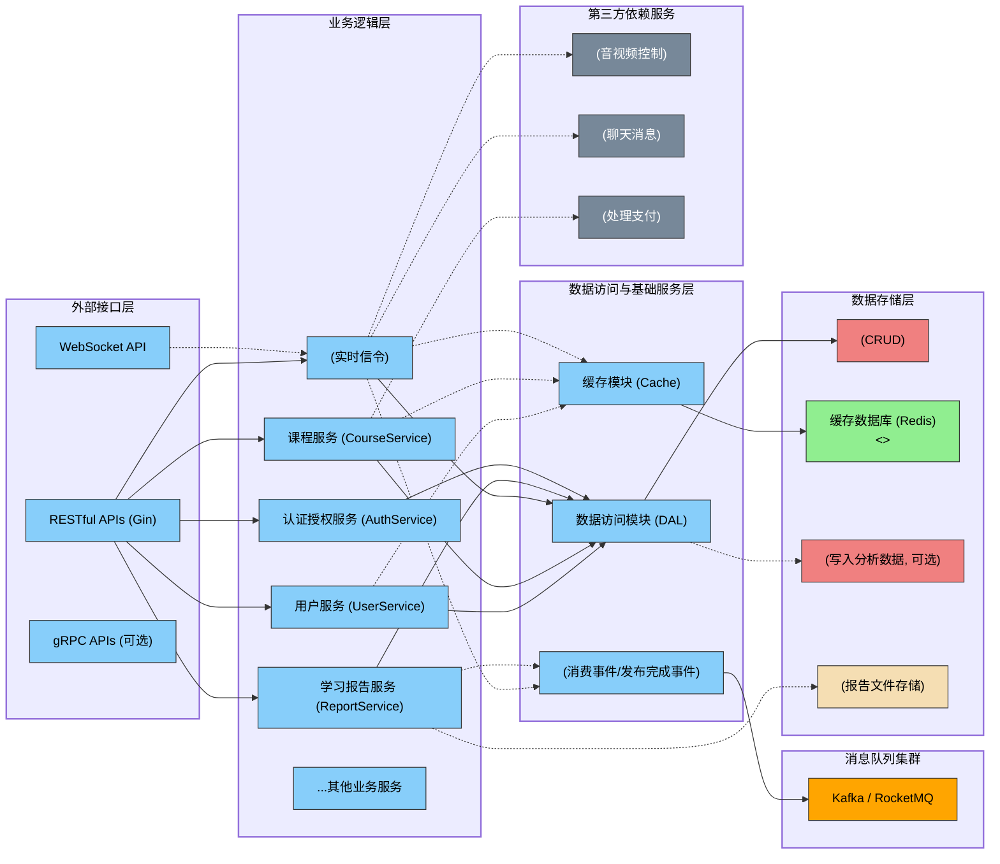
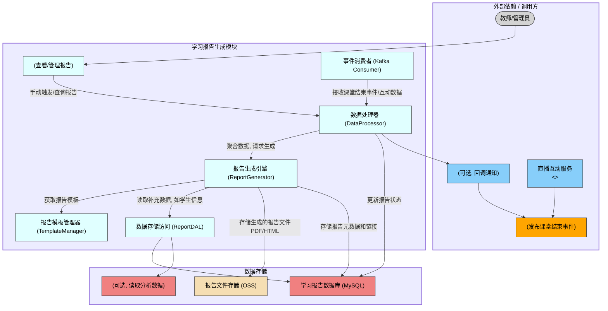
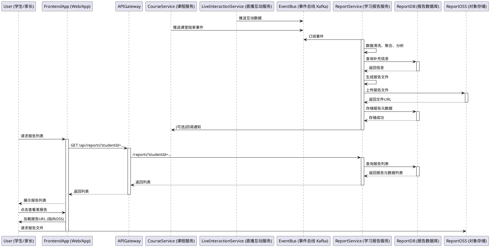

*智慧课堂-技术方案-服务端模板*

- [1. 版本与职责](#1-版本与职责)
  - [1.1. 修订历史](#11-修订历史)
  - [1.2. 责任人职责](#12-责任人职责)
  - [1.3. 具体责任人分配](#13-具体责任人分配)
- [2. 项目概述与技术目标](#2-项目概述与技术目标)
  - [2.1. 业务背景](#21-业务背景)
  - [2.2. 核心需求与设计参考](#22-核心需求与设计参考)
  - [2.3. 方案目标](#23-方案目标)
  - [2.4. 技术范围](#24-技术范围)
  - [2.5. 上下游依赖](#25-上下游依赖)
    - [2.5.1. 上游依赖 (本方案强依赖的系统/模块/数据)](#251-上游依赖-本方案强依赖的系统模块数据)
    - [2.5.2. 下游依赖 (依赖本方案产出的系统/模块)](#252-下游依赖-依赖本方案产出的系统模块)
  - [2.6. 技术栈选型](#26-技术栈选型)
  - [| ...              | ...                                   | ...                                                                             |                             |](#--------------------------------------------------------------------------------------------------------------------------------------------------------------)
- [3. 系统整体架构设计](#3-系统整体架构设计)
  - [3.1. 整体逻辑架构图 / 部署架构图](#31-整体逻辑架构图--部署架构图)
  - [3.2. 模块详细架构图](#32-模块详细架构图)
  - [3.3. 关键业务/技术流程时序图](#33-关键业务技术流程时序图)
- [4. 服务端核心模块详细设计](#4-服务端核心模块详细设计)
  - [4.1. \[核心模块一名称\]](#41-核心模块一名称)
    - [4.1.1. 模块职责与目标](#411-模块职责与目标)
    - [4.1.2. 重点逻辑与算法](#412-重点逻辑与算法)
    - [4.1.3. 内部组件/类图 (用于展示复杂模块的内部结构)](#413-内部组件类图-用于展示复杂模块的内部结构)
    - [4.1.4. 关键考量点](#414-关键考量点)
  - [4.2. \[核心模块二名称，例如：配置管理模块\]](#42-核心模块二名称例如配置管理模块)
- [5. 接口设计 (API Specification)](#5-接口设计-api-specification)
  - [5.1. 结构规范](#51-结构规范)
  - [5.2. 涉及接口列表](#52-涉及接口列表)
- [6. 数据库设计](#6-数据库设计)
  - [6.1. 数据库表结构](#61-数据库表结构)
- [7. 测试策略](#7-测试策略)
  - [7.1 单元测试](#71-单元测试)
  - [7.2 集成测试](#72-集成测试)
  - [7.3 端到端测试 (E2E Tests)](#73-端到端测试-e2e-tests)
  - [7.4 性能测试](#74-性能测试)
  - [7.5 安全测试](#75-安全测试)
- [8. 附录](#8-附录)
  - [8.1 术语表](#81-术语表)
  - [8.2 参考文档](#82-参考文档)

# 1. 版本与职责

## 1.1. 修订历史

[需求变更、代码编写、bug fix 等导致技术方案变更，需要同步到本章节。]

| 版本 | 修订日期   | 修订描述                                 | 修改人 |
| :--- | :--------- | :--------------------------------------- | :----- |
| v1.0 | YYYY-MM-DD | 初版创建                                 | [姓名] |
| v1.1 | YYYY-MM-DD | 根据XX评审意见修改XX章节                 | [姓名] |
| ...  | ...        | ...                                      | ...    |

## 1.2. 责任人职责

[根据团队具体情况，明确各端口或模块的责任人及其职责，可参照以下在线课堂战斗单元示例进行调整。]

| 人员角色     | 主要职责                                                                                                                                                              |
| :----------- | :-------------------------------------------------------------------------------------------------------------------------------------------------------------------- |
| **总负责人**   | 1. 负责技术方案的整体完整性、一致性、前瞻性和合理性。<br>2. 作为技术方案变更（需求、设计、实现层面）的第一同步责任人。<br>3. 负责跨模块/跨团队的技术协调与沟通。<br>4. 负责最终技术选型、架构决策的把关。<br>5. 作为整体项目/功能上线后的技术问题总接口人。 |
| **服务端负责人** | 1. 负责服务端技术方案的详细设计、合理性及可实施性。<br>2. 确保服务端方案与整体架构及其他各端方案的协同一致。<br>3. 负责服务端模块的开发、联调、部署及上线工作。<br>4. 作为服务端线上问题的第一接口人。                                                                     |
| **授课端负责人** | 1. 负责授课端技术方案的合理性，并确保与服务端及其他相关端的技术对接顺畅。<br>2. 授课端涉及的技术方案变更需及时周知并更新相关文档。                                                                       |
| **学生端负责人** | 1. 负责学生端（可能包含PC、App、Web等多端）技术方案的合理性与一致性。<br>2. 确保学生端与服务端的技术对接，关注用户体验和性能。<br>3. 学生端涉及的技术方案变更需及时周知并更新相关文档。                                                               |
| **辅导端负责人** | 1. 负责辅导端技术方案的合理性，确保满足辅导教学场景的技术需求。<br>2. 负责与服务端及其他相关端的技术对接。<br>3. 辅导端涉及的技术方案变更需及时周知并更新相关文档。                                                                     |
| **测试负责人**   | 1. 负责制定和执行本技术方案相关的整体测试策略和测试计划（包括单元测试、集成测试、系统测试、性能测试等）。<br>2. 协调测试资源，跟踪缺陷修复，对上线质量负责。                                                                     |
| **协作人**     | 协助对应端口或模块的负责人，参与技术方案的讨论、设计、文档编写、代码实现、测试等工作。                                                                                           |

## 1.3. 具体责任人分配

*[某端或某角色若不涉及，可以留空或注明"不适用"。端口划分可与1.2节对应。]*

| 端口/角色    | 负责人姓名 | 协作人姓名 (可多人)                                     |
| :----------- | :--------- | :------------------------------------------------------ |
| **整体方案**   | [姓名]     | [姓名A], [姓名B]                                        |
| **服务端**   | [姓名]     | [姓名C], [姓名D]                                        |
| **授课端**   | [姓名]     | [姓名E]                                                 |
| **学生端**   | [姓名]     | [姓名F], [姓名G], [姓名H]                               |
| **辅导端**   | [姓名]     | [姓名I]                                                 |
| **测试**     | [姓名]     | [乐读测试团队: 张三], [素养测试团队: 李四], [企培测试团队: 王五] |

---

# 2. 项目概述与技术目标

## 2.1. 业务背景

*[请在此处详细描述项目或功能的业务背景、来源、要解决的核心业务问题以及它对用户的价值。]*
> *   "为提升在线大班课的互动性和教学效果，满足教师对随堂测验、实时答疑、分组讨论等多样化教学工具的需求，特规划本次'智慧课堂互动增强模块'的开发..."
> *   "当前系统的学习报告生成效率低下，且内容单一，无法满足个性化辅导的需求。本项目旨在构建一套全新的、高效的、可定制化的学习报告系统..."

## 2.2. 核心需求与设计参考

*   **需求详情**: [请链接到详细的产品需求文档 (PRD) 或用户故事列表。简要概述核心功能需求点。]
    > * 需求点1: [例如：支持教师在直播中发布单选、多选、判断题]
    > * 需求点2: [例如：学生端实时接收并作答，结果实时汇总给教师]
    > * ...
*   **设计详情**: [请链接到相关的UI/UX设计稿、交互原型或视觉规范文档。]

## 2.3. 方案目标

*[清晰、简洁地描述本技术方案旨在解决的具体技术问题或实现的技术目标。避免宽泛的业务目标，聚焦技术层面。]*
> **示例：**
> * 设计并实现一套高并发、低延迟的实时互动信令服务，支持至少5000人同时在线的单教室互动场景。
> * 构建一个可扩展的数据处理管道，用于近实时地分析课堂互动数据，并在课后5分钟内生成初步的学情分析报告。
> * 重构现有的用户权限管理模块，引入RBAC模型，以支持更细粒度的操作权限控制和多角色身份管理。

## 2.4. 技术范围

*[明确定义本方案涉及的技术边界，哪些做，哪些不做。]*

**包含范围 (In Scope):**
*   [服务端XX模块的设计与实现]
*   [新增/修改的XX API接口定义与实现]
*   [XX数据表的创建/修改]
*   [与XX、YY等外部系统的集成对接]
*   [关键技术点：例如，长连接管理、消息推送、分布式缓存应用]
*   ...

> **示例 (智慧课堂互动模块):**
> *   实时互动信令服务器的设计与实现 (WebSocket/WebRTC)。
> *   互动消息（如答题卡、举手、点赞）的定义、收发、存储与转发逻辑。
> *   教师端发布互动、学生端接收/提交互动、结果统计与展示相关的服务端API。
> *   互动数据持久化方案 (MySQL/NoSQL)。
> *   与现有用户服务、课程服务的集成。

**排除范围 (Out of Scope):**
*   [客户端（授课端、学生端）的具体UI实现细节]
*   [复杂的历史数据迁移方案（若涉及，应另立专项）]
*   [基础的监控告警平台搭建（本方案将基于已有平台进行指标接入）]
*   [未来版本可能考虑的XX功能，如基于AI的作答行为分析]
*   ...

## 2.5. 上下游依赖

### 2.5.1. 上游依赖 (本方案强依赖的系统/模块/数据)
*   **依赖方1**: [例如：用户中心服务]
    *   依赖接口/数据: [例如：获取用户信息接口、用户身份校验]
    *   负责人: [姓名]
*   **依赖方2**: [例如：课程管理服务]
    *   依赖接口/数据: [例如：获取课程信息、教室成员列表]
    *   负责人: [姓名]
*   ...

### 2.5.2. 下游依赖 (依赖本方案产出的系统/模块)
*   **依赖方1**: [例如：学生端App]
    *   依赖接口/数据: [例如：本方案定义的实时互动API]
    *   负责人: [姓名]
*   **依赖方2**: [例如：数据分析平台]
    *   依赖接口/数据: [例如：本方案产生的互动原始数据]
    *   负责人: [姓名]
*   ...

## 2.6. 技术栈选型

*[列出本方案最终确定的关键技术、框架、库、中间件、云服务等，并简要说明选型理由。]*

| 技术领域         | 选用技术/工具 (含版本)                | 选型理由                                                                        | 备选方案 (若有重要备选可列出) |
| :--------------- | :------------------------------------ | :------------------------------------------------------------------------------ | :-------------------------- |
| **编程语言**     | [例如: Go 1.18+]                      | [例如: 高并发性能优异, 静态类型安全, 部署简便, 团队有成熟经验]                      | [例如: Java 11+, Python 3.9+] |
| **Web/RPC框架**  | [例如: Gin (Web), gRPC (RPC)]         | [例如: Gin轻量高效, gRPC跨语言性能好, Protobuf定义清晰]                           | [例如: Spring Boot, Dubbo]    |
| **数据库**       | [例如: PostgreSQL 14+, MySQL 8.0+]    | [例如: PostgreSQL功能强大, ACID兼容, 扩展性好; MySQL生态成熟, 社区支持广泛]        | [例如: MongoDB, TiDB]       |
| **缓存**         | [例如: Redis 7.0+]                    | [例如: 高性能KV存储, 支持多种数据结构, 具备发布订阅、分布式锁等能力]                  | [例如: Memcached]           |
| **消息队列**     | [例如: Kafka 3.x, RocketMQ 5.x]       | [例如: Kafka高吞吐、高可用，适用于日志和事件流；RocketMQ金融级可靠性，事务消息支持好] | [例如: RabbitMQ, Pulsar]    |
| **实时通讯**     | [例如: WebSocket, WebRTC (信令自建)]  | [例如: WebSocket双向通讯，浏览器原生支持；WebRTC P2P音视频能力强]                 | [例如: Socket.IO]           |
| **容器化与编排** | [例如: Docker, Kubernetes (K8s) 1.25+] | [例如: Docker环境一致性, K8s自动化部署、伸缩和管理]                               |                             |
| **云服务 (可选)** | [例如: 阿里云RDS, OSS, ACK (K8s服务)] | [例如: 降低运维成本, 提供高可用保障, 弹性伸缩]                                  |                             |
| ...              | ...                                   | ...                                                                             |                             |
---

# 3. 系统整体架构设计

*[从一个整体的视角对系统所有模块进行描述；注重模块的划分、衔接、联动以及数据流向。]*

## 3.1. 整体逻辑架构图 / 部署架构图

*[根据实际情况选择最能表达系统核心结构的图表类型。可以是逻辑分层图、组件交互图，或者是更具体的部署图。请使用PlantUML/Mermaid进行绘制，并针对本项目进行定制。]*

**示例：智慧课堂服务端逻辑分层架构**


*   **核心组件/服务说明:**
    *   `API网关 (APIGateway)`: [例如：统一入口，负责请求路由、认证鉴权、限流熔断、日志记录、协议转换等]
    *   `用户服务 (UserService)`: [例如：管理用户信息、角色权限、登录注册等]
    *   `课程服务 (CourseService)`: [例如：管理课程信息、章节、排课、师生关系等]
    *   `直播互动服务 (LiveInteractionService)`: [例如：处理直播间内的实时信令，如白板、答题器、聊天、举手等]
    *   `学习报告服务 (ReportService)`: [例如：收集课堂数据，生成和管理学习报告]
    *   `认证授权服务 (AuthService)`: [例如：提供Token生成与校验，细粒度权限判断]
    *   `数据访问模块 (DAL)`: [例如：封装对数据库的CRUD操作，提供统一的数据访问接口]
    *   `缓存数据库 (Redis)`: [例如：存储热点数据、用户Session、分布式锁等]
    *   `消息队列 (Kafka/RocketMQ)`: [例如：用于服务解耦、异步任务处理、事件驱动]
    *   `实时音视频服务 (TRTC/Agora)`: [例如：提供底层的音视频流传输和处理能力]
    *   ...

## 3.2. 模块详细架构图

*[针对本方案重点设计或修改的**核心模块**，绘制其内部详细架构图。说明该模块在整体架构中的位置、内部组件划分、组件间交互以及与外部模块的依赖关系。可使用PlantUML/Mermaid绘制组件图]*

**示例：[本方案核心模块名称，如：学习报告生成模块] 架构图**


*   **模块职责**: [清晰描述该模块的核心职责，例如：负责从原始课堂数据中提取、分析并生成结构化的学习报告。]
*   **内部组件说明**:
    *   `事件消费者`: [例如：订阅课堂结束、互动数据等Kafka消息，触发后续处理流程。]
    *   `数据处理器`: [例如：对原始数据进行清洗、转换、聚合，准备报告生成所需的数据。]
    *   `报告生成引擎`: [例如：根据模板和处理后的数据，实际生成报告文件（如PDF、HTML）。]
    *   ...

## 3.3. 关键业务/技术流程时序图

*[针对本模块核心的业务流程或复杂的技术交互，使用时序图进行说明。可使用PlantUML/Mermaid 的时序图]*
**示例：[本方案核心流程，如：一次完整的学习报告生成与查看流程]**


---
# 4. 服务端核心模块详细设计

*[本章节针对服务端实现的核心模块进行更深入的阐述。如果模块较多，每个模块可以作为一个子章节。]*

## 4.1. [核心模块一名称]
> 例如：实时互动处理模块

### 4.1.1. 模块职责与目标
*   [清晰描述该模块的核心职责和设计目标]
> 例如：负责处理直播过程中的所有实时互动信令，保证消息的低延迟、高可靠投递，并记录互动数据。

### 4.1.2. 重点逻辑与算法
*   [详细描述该模块的关键处理逻辑、核心算法、状态机（如果涉及复杂状态转换）等。]
    *   **信令连接管理**: [例如：如何处理WebSocket/长连接的建立、维持、心跳、断线重连。用户状态（在线/离线）如何同步。]
    *   **消息格式与解析**: [定义互动消息（如JSON/Protobuf）的具体格式，服务端如何解析和校验。]
    *   **消息路由与分发**: [例如：单聊、群聊、广播消息的路由策略。如何确保消息准确投递到目标用户或教室。]
    *   **并发控制与顺序保证**: [例如：针对特定资源（如答题器状态）的并发修改如何处理？是否需要保证某些消息的顺序性？]
    *   **数据持久化策略**: [哪些互动数据需要实时/准实时持久化？存储方案是什么？]
*   **关键流程图 (活动图/流程图)**:
    ```plantuml
    @startuml
    ' 活动图：实时互动消息处理流程 (兼容版)

    start

    :接收到客户端消息 (WebSocket);

    if (连接有效性及用户身份校验?) then (是)
    :解析消息体 (JSON/Protobuf);
    if (消息格式校验通过?) then (是)
        if (消息类型是 "聊天消息"?) then (是)
        :进行敏感词过滤 (可选);
        :投递到目标用户/群组;
        :异步记录聊天日志;
        else if (消息类型是 "答题卡提交"?) then (是)
        :校验答题有效性;
        :记录学生答案;
        :实时统计答题进度 (可选);
        :通知教师端更新 (可选);
        else if (消息类型是 "白板操作"?) then (是)
        :校验操作权限;
        :广播白板信令给其他用户;
        :异步记录操作日志;
        else if (消息类型是 "心跳包"?) then (是)
        :更新用户最后活跃时间;
        :响应心跳;
        else (是其他业务信令)
        :执行对应业务逻辑;
        endif
    else (消息格式校验失败)
        :记录错误日志;
        :向发送方返回错误提示 (可选);
    endif
    else (连接或身份校验失败)
    :记录非法访问尝试;
    :关闭连接 (可选);
    endif

    stop

    @enduml
    ```

### 4.1.3. 内部组件/类图 (用于展示复杂模块的内部结构)
*   [可使用PlantUML类图展示核心类及其关系。]
    ```plantuml
    @startuml 实时互动模块核心类图示例
    class WebSocketConnectionManager {
      +addConnection(connection)
      +removeConnection(connectionId)
      +getConnection(userId): Connection
      +broadcastToRoom(roomId, message)
    }
    interface MessageHandler {
      +canHandle(messageType): boolean
      +handle(connection, message)
    }
    class ChatMessageHandler implements MessageHandler
    class QuizMessageHandler implements MessageHandler
    WebSocketConnectionManager o-- "*" Connection
    MessageHandler <|.. ChatMessageHandler
    @enduml
    ```

### 4.1.4. 关键考量点
*   **性能**: [如何保证低延迟？消息处理QPS目标？]
*   **可靠性**: [消息丢失如何处理？服务宕机恢复机制？]
*   **扩展性**: [如何水平扩展以支持更多并发用户和教室？]
*   **安全性**: [消息内容是否需要加密？如何防止恶意连接和消息攻击？]

## 4.2. [核心模块二名称，例如：配置管理模块]

*(同4.1结构，描述其他核心模块的详细设计)*

---
# 5. 接口设计 (API Specification)

*[详细描述本服务端对外提供的所有HTTP/RPC接口。遵循统一的规范和格式。]*

## 5.1. 结构规范

- 接口基础路径：/api/[版本]
- 请求方法：GET/POST/PUT/DELETE
- 认证方式：Bearer Token (JWT)
- 返回格式：统一 JSON 格式

```json
{
  "code": 0, // 状态码：0-成功，非0-失败
  "message": "success", // 状态描述
  "data": {
    // 响应数据
    // 具体数据结构
  }
}
```

> 示例：
> - 接口基础路径：/api/v1
> - 请求方法：GET/POST/PUT/DELETE
> - 认证方式：Bearer Token
> - 状态码约定：0-成功，1000-1999-参数错误，2000-2999-业务错误，3000-3999-系统错误

## 5.2. 涉及接口列表
```
[请求方法] [接口路径]
请求参数：
{
    "参数1": "类型",
    "参数2": "类型",
    "参数3": "类型"
}
响应结果：
{
    "code": 0,
    "message": "success",
    "data": {
        "字段1": "值1",
        "字段2": "值2",
        "字段3": "值3"
    }
}
```

> 示例：
> ```
> POST /api/v1/auth/login
> 请求参数：
> {
>     "username": "string",     // 用户名/邮箱/手机号
>     "password": "string",
>     "captcha_code": "string", // 可选，验证码
>     "mfa_code": "string"      // 可选，MFA验证码
> }
> 响应结果：
> {
>     "code": 0,
> }

---
# 6. 数据库设计

*[详细描述本方案涉及的数据库表结构、数据模型、重要索引和数据字典。]*

## 6.1. 数据库表结构
```sql
-- [表名1]
DROP TABLE IF EXISTS `模块名_表名1`;
CREATE TABLE `模块名_表名1` (
    `id` bigint UNSIGNED NOT NULL AUTO_INCREMENT COMMENT '主键ID',
    -- 业务字段（根据业务需求添加）
    `字段1` varchar(255) NOT NULL COMMENT '字段1说明',
    `字段2` text NULL DEFAULT NULL COMMENT '字段2说明',
    `字段3` int NOT NULL DEFAULT 0 COMMENT '字段3说明',
    `related_table_id` bigint UNSIGNED NULL DEFAULT NULL COMMENT '关联表ID',
    -- 状态字段
    `status` tinyint NOT NULL DEFAULT 1 COMMENT '状态：0-禁用 1-启用',
    -- 多语言支持（如需要）
    `lang` varchar(10) NOT NULL DEFAULT 'zh-CN' COMMENT '语言（zh-CN:简体中文, zh-HK:繁体中文）',
    -- 基础字段（必需）
    `created_at` timestamp NULL DEFAULT NULL COMMENT '创建时间',
    `updated_at` timestamp NULL DEFAULT NULL COMMENT '更新时间',
    `deleted_at` timestamp NULL DEFAULT NULL COMMENT '删除时间',
    -- 创建和更新人（审计字段）
    `created_by` bigint UNSIGNED NOT NULL COMMENT '创建人',
    `updated_by` bigint UNSIGNED NOT NULL COMMENT '更新人',
    -- 索引
    PRIMARY KEY (`id`) USING BTREE,
    INDEX `idx_status` (`status`) USING BTREE,
    INDEX `idx_related_table_id` (`related_table_id`) USING BTREE,
    -- 其他所需索引（根据业务查询需求添加）
    INDEX `idx_字段1` (`字段1`) USING BTREE,
    INDEX `idx_created_at` (`created_at`) USING BTREE
) ENGINE = InnoDB CHARACTER SET = utf8mb4 COLLATE = utf8mb4_unicode_ci COMMENT '表1说明';
```

> 示例：
> ```sql
> -- 用户表
> DROP TABLE IF EXISTS `member_users`;
> CREATE TABLE `member_users` (
>     `id` bigint UNSIGNED NOT NULL AUTO_INCREMENT COMMENT '用户ID',
>     `username` varchar(50) NOT NULL COMMENT '用户名',
>     `password` varchar(100) NOT NULL COMMENT '密码（加密）',
>     `email` varchar(100) NOT NULL COMMENT '邮箱',
>     `mobile` varchar(20) NULL DEFAULT NULL COMMENT '手机号',
>     `nickname` varchar(50) NULL DEFAULT NULL COMMENT '昵称',
>     `avatar` varchar(255) NULL DEFAULT NULL COMMENT '头像URL',
>     `gender` tinyint NOT NULL DEFAULT 0 COMMENT '性别（0:未知, 1:男, 2:女）',
>     `status` tinyint NOT NULL DEFAULT 1 COMMENT '状态（0:禁用, 1:启用）',
>     `last_login_time` timestamp NULL DEFAULT NULL COMMENT '最后登录时间',
>     `last_login_ip` varchar(50) NULL DEFAULT NULL COMMENT '最后登录IP',
>     `created_at` timestamp NULL DEFAULT NULL COMMENT '创建时间',
>     `updated_at` timestamp NULL DEFAULT NULL COMMENT '更新时间',
>     `deleted_at` timestamp NULL DEFAULT NULL COMMENT '删除时间',
>     `created_by` bigint UNSIGNED NOT NULL COMMENT '创建人',
>     `updated_by` bigint UNSIGNED NOT NULL COMMENT '更新人',
>     PRIMARY KEY (`id`) USING BTREE,
>     UNIQUE INDEX `uk_username` (`username`) USING BTREE,
>     UNIQUE INDEX `uk_email` (`email`) USING BTREE,
>     UNIQUE INDEX `uk_mobile` (`mobile`) USING BTREE,
>     INDEX `idx_status` (`status`) USING BTREE,
>     INDEX `idx_created_at` (`created_at`) USING BTREE
> ) ENGINE = InnoDB CHARACTER SET = utf8mb4 COLLATE = utf8mb4_unicode_ci COMMENT '会员用户表';
> ```
---
# 7. 测试策略

## 7.1 单元测试
*   **范围:** [核心业务逻辑、工具类、复杂算法]
*   **工具:** [例如: JUnit, Mockito, pytest, unittest.mock]
*   **覆盖率目标:** [例如: > 80% 行覆盖率]

## 7.2 集成测试
*   **范围:** [模块/服务间接口调用, 与数据库/缓存/消息队列的交互]
*   **工具:** [例如: Spring Boot Test, pytest-django, Postman/Newman]
*   **关键场景:** [列出需要覆盖的关键集成场景]

## 7.3 端到端测试 (E2E Tests)
*   **范围:** [模拟真实用户操作的关键业务流程]
*   **工具:** [例如: Selenium, Cypress, Playwright]
*   **关键场景:** [例如: 用户注册->登录->下单->支付]

## 7.4 性能测试
*   **范围:** [核心接口, 压力大的业务流程]
*   **工具:** [例如: JMeter, Locust, k6]
*   **场景:** [并发用户数、请求量、数据量]
*   **目标:** [验证是否满足非功能需求中的性能指标]

## 7.5 安全测试
*   **范围:** [输入验证、权限控制、依赖漏洞、常见 Web 漏洞]
*   **工具:** [例如: OWASP ZAP, Burp Suite, Snyk, Trivy]
*   **方法:** [渗透测试、代码审计]

---
# 8. 附录

## 8.1 术语表
| 术语 | 说明 |
|------|------|
| [术语1] | [术语1解释] |
| [术语2] | [术语2解释] |
| [术语3] | [术语3解释] |
| [术语4] | [术语4解释] |

> 示例：
> | 术语 | 说明 |
> |------|------|
> | MFA | Multi-Factor Authentication，多因素认证 |
> | RBAC | Role-Based Access Control，基于角色的访问控制 |
> | SSO | Single Sign-On，单点登录 |
> | JWT | JSON Web Token，用于身份认证的令牌标准 |

## 8.2 参考文档
- [参考文档1]
- [参考文档2]
- [参考文档3]
- [参考文档4]

> 示例：
> - Laravel官方文档
> - RBAC权限模型设计最佳实践
